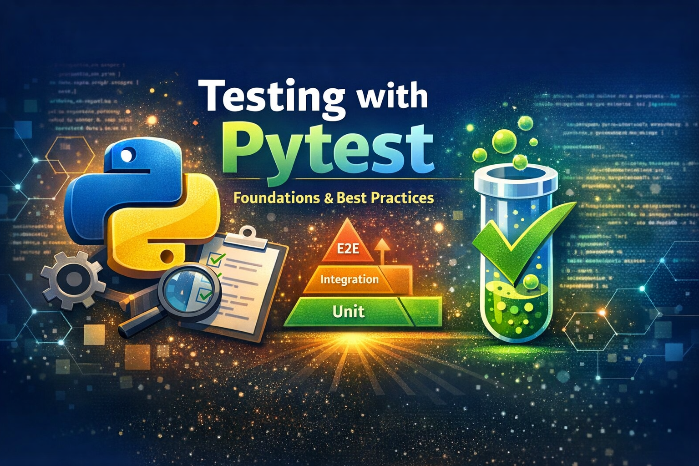

<!--  -->

Testar software não é apenas uma etapa técnica do desenvolvimento é uma **estratégia de qualidade, confiança e sustentabilidade**. Sistemas sem testes tendem a quebrar com frequência, gerar medo de mudanças e aumentar drasticamente o custo de manutenção.

Neste post, vamos focar **100% na teoria**, explicando conceitos fundamentais de testes automatizados usando **Pytest**, o framework de testes mais popular do ecossistema Python.

> 👉 No próximo post da série, aplicaremos tudo isso em um **projeto Flask real consumindo a API pública do GitHub**.

---

## O que é Pytest?

Pytest é um framework de testes para Python que facilita a criação de testes simples, legíveis e escaláveis. Ele permite testar desde funções isoladas até sistemas completos.

### Por que Pytest é tão usado?
- Sintaxe simples (baseada em `assert`)
- Descoberta automática de testes
- Sistema poderoso de **fixtures**
- Excelente suporte a **plugins**
- Escala bem para projetos grandes

Comparado ao `unittest`, o Pytest é mais expressivo, menos verboso e mais produtivo.

---

## Qual é o objetivo dos testes?

Testes existem para **reduzir incerteza**.

Eles ajudam a:
- Garantir que o código funciona como esperado
- Detectar erros rapidamente
- Evitar regressões
- Permitir refatorações seguras
- Servir como documentação viva do sistema

Um código sem testes pode até funcionar hoje, mas é frágil amanhã.

---

## Quando escrever testes?

- Ao criar novas funcionalidades
- Ao corrigir bugs (especialmente regressões)
- Antes de refatorar código existente
- Em código crítico para o negócio

### E quando NÃO escrever testes?

- Provas de conceito muito rápidas (POCs)
- Scripts totalmente descartáveis

Mesmo nesses casos, testes ainda podem trazer benefícios.

---

## Tipos de Testes

Entender os tipos de testes é essencial para criar uma **estratégia equilibrada**.

### Testes Unitários

- Testam funções ou métodos isolados
- Não acessam banco, rede ou sistema de arquivos
- São rápidos e baratos

✔️ Base da pirâmide de testes

---

### Testes de Integração

- Testam a comunicação entre componentes
- Exemplo: aplicação + banco, aplicação + API externa

✔️ Detectam falhas reais de integração
❌ Mais lentos

---

### Testes Funcionais

- Testam fluxos completos da aplicação
- Simulam o comportamento do usuário

✔️ Alta confiança
❌ Mais complexos

---

### Testes de Sistema / End-to-End (E2E)

- Testam o sistema como um todo
- Incluem múltiplas camadas

✔️ Simulam uso real
❌ Lentos e frágeis

---

### Testes de Regressão

- Garantem que bugs corrigidos não voltem
- Normalmente surgem após incidentes reais

✔️ Protegem contra erros reincidentes

---

### Testes de Performance

- Avaliam tempo de resposta e consumo de recursos
- Identificam gargalos

✔️ Importantes em sistemas críticos
❌ Devem ser usados com critério

---

## A Pirâmide de Testes

Uma boa estratégia de testes segue a pirâmide:

- Muitos testes unitários
- Alguns testes de integração
- Poucos testes E2E

Isso garante velocidade, confiança e custo controlado.

---

## O padrão AAA (Arrange, Act, Assert)

AAA é um padrão de organização de testes que melhora drasticamente a legibilidade.

### Arrange
Preparar dados, mocks e contexto.

### Act
Executar a ação que está sendo testada.

### Assert
Validar o resultado.

### Benefícios
- Testes mais claros
- Menos ambiguidade
- Manutenção mais fácil

---

## Fixtures no Pytest

Fixtures são funções reutilizáveis responsáveis por **preparar e limpar o ambiente de testes**.

### Por que usar fixtures?
- Evitam duplicação de código
- Centralizam setup/teardown
- Tornam os testes mais legíveis

### Escopos de fixtures
- `function`: padrão (executa a cada teste)
- `module`: uma vez por arquivo
- `session`: uma vez por execução

---

## Pytest Marks

Marks permitem **classificar e controlar** testes.

### parametrize

Permite rodar o mesmo teste com vários dados.

**Benefícios:**
- Menos código
- Mais cobertura
- Testes mais expressivos

---

### skip

Ignora testes conscientemente.

**Quando usar:**
- Dependência externa indisponível
- Funcionalidade desativada

---

### xfail

Marca testes que **devem falhar**.

**Benefícios:**
- Documenta bugs conhecidos
- Não quebra o pipeline

---

### slow

Marca testes lentos.

**Benefícios:**
- Execução seletiva
- Feedback rápido no dia a dia

---

## O que é Mock?

Mock é uma técnica usada para **simular dependências externas**.

### Quando usar mock?
- APIs externas
- Banco de dados
- Serviços de terceiros

### Quando NÃO usar?
- Para testar lógica interna
- Em excesso (overmocking)

---

## unittest.mock vs pytest-mock

### unittest.mock

- Biblioteca padrão do Python
- Mais verbosa
- Usa context managers

✔️ Não depende de plugins
❌ Código mais difícil de ler

---

### pytest-mock

- Plugin do Pytest
- Integração com fixtures
- Sintaxe mais limpa

✔️ Mais produtivo
✔️ Mais legível

---

## Plugins Essenciais do Pytest

### pytest-cov

- Mede cobertura de código
- Ajuda a identificar áreas não testadas

⚠️ Cobertura alta ≠ código de qualidade

---

### pytest-mock

- Facilita criação de mocks
- Reduz boilerplate

---

## Boas Práticas Gerais

- Testes devem ser simples
- Um comportamento por teste
- Nomes claros e descritivos
- Evite lógica complexa nos testes
- Testes devem ser determinísticos

---

## Conclusão

Testes automatizados não são um luxo, são uma **necessidade profissional**. Pytest fornece as ferramentas certas para escrever testes claros, escaláveis e confiáveis.

No próximo post da série, vamos **aplicar todos esses conceitos em um projeto Flask real**, consumindo a API pública do GitHub, com testes unitários, de integração, funcionais e de performance.

👉 Continue para o **Post 2: [Testando APIs do GitHub com Pytest - Prática]())**

